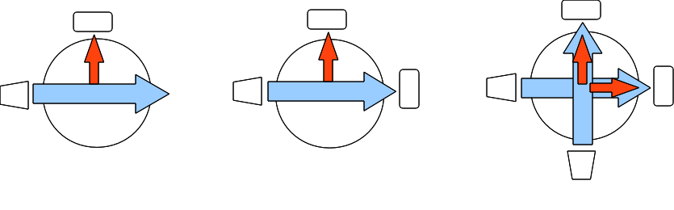

# The Open Turbidimeter Project

## Contents
- [Background](#background)
- [What is "Turbidity"?](#what-is-turbidity)
- [Measuring Turbidity](#measuring-turbidity)
- [Goals for the Turbidimeter](#goals-for-the-turbidimeter)
- [Connectivity](#connectivity)
- [Development and Dependencies](#development-and-dependencies)
- [Licensing](#licensing)
- [Funding Sources](#funding-sources)
- [Contact](#contact)

## Background

The high cost of equipment to monitor water quality often puts valuable health tools out of reach for many communities in developing countries. Consequently, millions of people are exposed to health risks that could me mitigated if solutions were available at a price point they can afford. **The goal of our project is to create a low-cost device to measure the turbidity of a water supply.**

## What Is "Turbidity"?

Turbidity refers to the dirtiness or cloudiness of a water sample, and an internationally recognized criterion for assessing drinking water quality because the colloidal particles in turbid water may harbor pathogens, chemically reduce oxidizing disinfectants, and hinder attempts to disinfect water with ultraviolet radiation. Technicians at water treatment plants regularly measure water turbidity before and after treatment. It’s a legal requirement in many countries, and one indicator of whether treated water is safe for human consumption. The unaided eye can distinguish cloudy water from clear water, but even visibly clear samples of water can be dangerous.

## Measuring Turbidity

The quantification of turbidity is complicated by the fact that the goal is to obtain an aggregate quasi-concentration of *all* the different types of particles present in the water. This is different than, say measuring the concentration of a *specific* chemical by adding known quantities of reagents and measuring the mass of the resulting precipitate.

A turbidimeter is an optical instrument that assesses turbidity by measuring the scattering of light passing through a water sample. The general principle is that the more particles are floating around in the water, the more light will be scattered as it passes from on one side of a sample to the other. In its simplest form, a turbidimeter is just a light source and a photosensor arranged perpendicular to each other around a water sample. More complicated setups using multiple sensors and/or light sources extend the detection limit and accuracy of the device. Some possible layouts are shown below.


*Source:* [turbidimeter-designs.png](turbidimeter-designs.png)

Turbidity is most commonly quantified by the Nephelometric Turbidity Unit (NTU)**\***. The NTU scale is defined by reference standards which are created by diluting approved compounds to concentrations designated by the [EPA][EPA Method 180.1] and [ISO][ISO 7027]. The primary standard for this scale is formazin, although other (safer) secondary standards have been approved. Note that these regulations have additional stipulations such as the measurement angle and wavelength of the light source. Looking over the standards themselves is *highly recommended.*

The human eye can detect turbidity levels down to roughly 5 or 10 NTU. Samples of water with turbidity lower than this will appear clear, but may still contain a concentration of colloidal particles sufficient to impair disinfection efforts and may carry a load of contaminants or pathogens sufficient to cause serious human illness. Current EPA regulations stipulate that conventionally treated surface water in the USA must be regularly sampled, that only 5% of samples in a given month may show turbidity greater than 0.3 NTU, and that no sample may show turbidity in excess of 1.0 NTU. Other countries employ different standards, and the World Health Organization (WHO) recommends that turbidity levels be less than 0.1 NTU prior to disinfection.

Handheld units capable of analyzing a single sample vial cost several hundred dollars; automated units capable of intermittently analyzing samples from flowing water can cost several thousand. Partly completed open-source turbidimeter projects can be found online, apparently abandoned.

**\*** Nephelometry is the term given to the side-scatter method of measuring turbidity described above

[EPA Method 180.1]: (http://water.epa.gov/scitech/methods/cwa/bioindicators/upload/2007_07_10_methods_method_180_1.pdf)
[ISO 7027]: http://www.iso.org/iso/catalogue_detail.htm?csnumber=30123

## Goals for the Turbidimeter

1.  Costs less than $100 when economies of scale are applied to production
2.  Reads samples with an accuracy of:
    1.  0.05 NTU from 0-5 NTU
    2.  0.2 NTU from 5-20 NTU
    3.  5% from 20-1000 NTU
3.  Can be operated manually or in automated sampling mode
4.  Has wireless data transmission capability
5.  Uses a replaceable battery pack

An open-source turbidimeter fulfilling the design goals listed above will not quite meet the strict technical requirements of the EPA, but will nonetheless provide a huge improvement over the status-quo of rural and small-scale water treatment monitoring, at a realistic cost.

## Connectivity

The intent is for these devices to be deployed at rivers, wells, and treatment plants in possibly very remote areas that are visited infrequently by engineers and regulators from more urban areas. For this reason, the device will be integrated with a remote data-acquisition system to enable record keeping, troubleshooting, and real-time observation of water quality. 

We are exploring a few different ways of getting data off the device wirelessly. The checked boxes indicate ones we've tested.

[x]  Include a low-power Bluetooth module that sends data to a linked Android cellphone, which uses its data plan and SMS to sync to a remote server. The problem with this is that the cost of a smartphone doubles or triples the cost of the device. The phone itself is also subject to damage or theft, which cripples the data connection. The additional processing power and memory afforded by a smartphone, on the other hand, is an attractive feature.
[x]  Integrate a GSM modem (the core piece of technology used by mobile phones) into the turbidimeter itself to provide wireless connectivity. This is a less expensive approach, but has issues with reliability and increases power consumption *quite a bit*. We also want to encourage DIYers to build their own units, and prototyping GSM modules like the one sold by Arduino are still not cheap. Therefore we want to make sure that the turbidimeter can still be used without wireless capability if we go with this approach.
[ ]  Connect the turbidimeter to an arbitrary mobile phone using a wired connection. This requires the hardware to support the connection (most likely a USB host adapter), but in theory any GSM-compliant phone would be controllable using it. Here's an example of an [Arduino-controlled Motorola Razr](https://www.circuitsathome.com/mcu/programming/interfacing-arduino-to-a-cellular-phone).

## Development and Dependencies

In the prototyping stage, most of the development is done using rapid prototyping tools like Arduino and 3D printed parts. We expect to transition off these tools soon as we finish designing custom components, although it will always be possible to build your own turbimeter by printing the parts and assembling the necessary circuitry.

A list of software and hardware dependencies is maintained in the file [Dependencies.md](Dependencies.md). We try to use all open-source design tools, although we are stuck with a few non-free packages at the moment. For these cases, we export to open formats (such as STL, STEP, and BRD).

Issue tracking, package releases, and the like are managed through GitHub, which is most likely where you are reading this anyways. To download the revision-controlled repository with all the latest code, use ```git clone https://github.com/wash4all/open-turbidimeter-project.git```. Alternately you can browse the [releases][] for a stable set of files that are known to work.

[releases]: https://github.com/wash4all/open-turbidimeter-project/releases

## Licensing

The software and documentation for the project are covered by the [GNU General Public License][gpl] and [Creative Commons ShareAlike-Attribution][cc] licenses, respectively.

[gpl]: https://www.gnu.org/copyleft/gpl.html
[cc]: https://creativecommons.org/licenses/by-sa/4.0/

## Funding Sources

The Open Turbidimeter Project has been funded in part by EPA Grant Number [SU835517][grant]: "Smart" Turbidimeters for Remote Monitoring of Water Quality.

[grant]: http://cfpub.epa.gov/ncer_abstracts/index.cfm/fuseaction/display.abstractDetail/abstract/10094/report/0

## Contact

Development of the Open Turbidimeter Project is facilitated by [WASH for All][], an organization working for universal access to clean drinking water and sanitation by developing innovative and cost-effective tools.

Contact [Chris][] or [Alex][] if you'd like to get involved with WASH for All or if you have questions about the project or the organization.

[WASH for All]: http://wash4all.org
[Chris]: mailto:iamchriskelley@gmail.com
[Alex]: mailto:amk283@cornell.edu