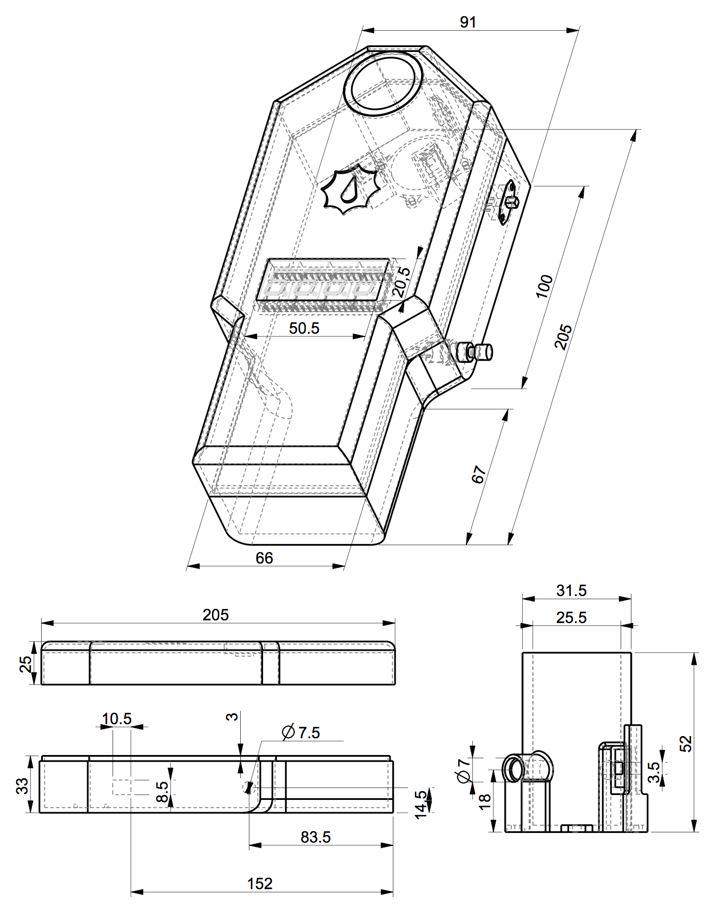
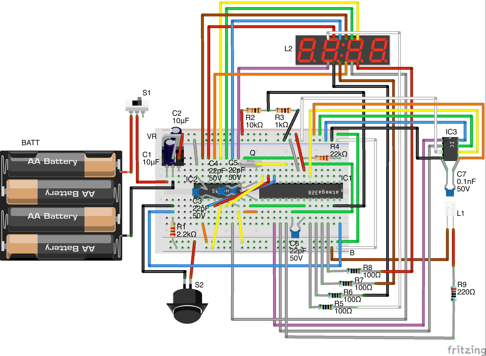
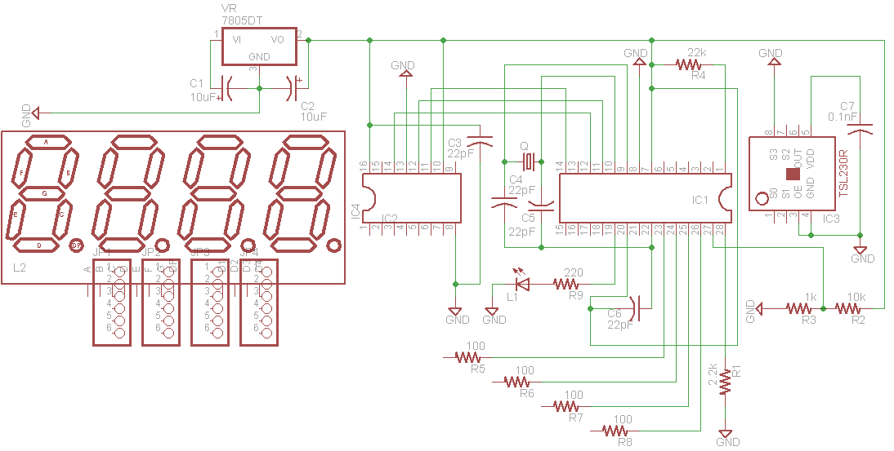

# Construction and Usage of the Turbidimeter

## Introduction

The sections below detail the necessary parts and tools, wiring, assembly, and microcontroller programming to get up and running with the Open Turbidimeter Project. You are encouraged to contact the team members with any questions about the construction, operation, or expansion of this device.

## Components List

All components of the open-source turbidimeter are indicated in the [Parts List](Parts List.tsv), along with potential
distributors. Indicated costs are for individual pieces and do not include shipping and handling or taxes.

## Structural Components

The open-source turbidimeter case consists of four different parts: (1) bottom, which includes ports for button and on/off switch; (2) cuvette holder, which houses the sensor and light source and holds the glass cuvette during device operation; (3) top, which has openings for the seven-segment LED display and the top of the cuvette holder; and (4) battery lid, which slides out from the case assembled case top and bottom to expose the battery holder. Electronic files of these objects (in STL format) are available in the [3D Design Files](3D Design Files/) folder. Note that any container that provides good shielding from incidental light may suffice for the larger portion of the case (e.g. a nested pair of cardboard boxes).


Link: [Assembly.png](3D Design Files/Assembly.png)

_**Fig 1** Image of the open-source turbidimeter with major dimensions given. The four smaller images (left to right) are the case lid (top left), the case base (bottom left), the battery lid (top right), and the cuvette holder (bottom right). All dimensions are in millimeters._

## Tools

A utility knife, soldering iron, and solder are required for assembly of the open-source turbidimeter, and safety goggles are recommended. To replicate the printed four-part case, one must have access to a 3D-printer with black ABS filament. The microprocessor can be programmed via a USB-to-Serial adapter (Mouser carries one [#A000059] for $14.95) or with an Arduino (as described in this [tutorial](http://arduino.cc/en/Tutorial/ArduinoToBreadboard). Electrical tape is very helpful (for grouping wires
together), as are a pair of wire strippers.

## Turbidimeter Breadboard and Schematic

The microprocessor and connected components of the open-source turbidimeter are depicted below in Fritzing (Figure S2) and EAGLE formats (Figure S3). Figure S2 depicts what the device looks like internally, while Figure S3 is a more formal schematic.


Link: [Fritzing Diagram](Electronic Schematics/Fritzing Diagram.png)
	
_**Fig 2** Depiction of the internal components of the open-source turbidimeter (components labels cross-referenced in the parts list and Figure S3)_


Link: [Circuit Schematic](Electronic Schematics/Schematic.png)

_**Fig 3** Schematic of the circuit board for the open-source turbidimeter (components labels cross-referenced in Table S1 and Figure S2)._

## Basic Assembly Instructions

1.  Gather the components listed in Section 1, and the tools listed in Section 3.
2.  Print the parts described in Section 2 (or devise your own light-shielding case).
3.  Wire together the internal components of the open-source turbidimeter according to Figures 2 and 3. Here are some key points:
    1.  It's hard to see some connections of the circuit, such as the wiring of the voltage regulator (VR1), on Figure 2. The Arduino website has a well-illustrated tutorial on wiring the ATMega328P microprocessor (http://arduino.cc/en/Main/Standalone) that the reader may find useful.
    2.  The semi-circles on the microprocessor (IC1) and shift register (IC2) indicate orientation of these components. It is vital that chips are aligned properly using these guides. Wiring them in the opposite orientation will destroy the chips once voltage is applied! Please note that the semi-circle on the TSL230R sensor in Figure 2 is merely a visual aid, and is not present on the actual chip.
    3.  The pins of the seven-segment display are diagrammed by the distributor Electrodragon (http://www.electrodragon.com/w/index.php?title=7-Segment_Display). The linked document maps pin placement to function and representation in Figure 3 (e.g., the bottom left pin on the seven-segment display is pin 12, which maps to segment E of the display, which connects to port QE on the shift register).
    4.  Resistors R2 and R3 combine to form a voltage divider, which is used to measure the voltage provided by the batteries. To achieve useful results, use resistors with tolerance of 1% or less. Tolerance levels of 5% are suitable for the other resistors in the device.
    5.  The internal components list generally should be followed closely, however the power switch (S1) and button (S2) can easily be changed to suit the builder's aesthetic.
    6.  As always, exercise caution. Do not attempt construction of any electrical device without knowledge of proper technique and safety.

## Programming

The files included in the ```software``` folder of the project need to be compiled and uploaded to the microcontroller to get the device working. Connect the device to a computer using a properly wired [USB-to-Serial adapter](http://arduino.cc/en/Main/USBSerial) (this requires the use of an additional 100nf capacitor) or an [Arduino board](http://arduino.cc/en/Tutorial/ArduinoToBreadboard). Then install the [Arduino programming environment](http://arduino.cc/en/main/software). After followng the instructions in the sofware readme to install the necessary libraries, open the ```turbidimeter.ino``` program in the Arduino software and upload it to the microcontroller.

You're ready to go! 